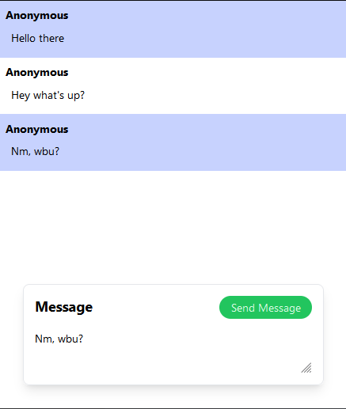

# chat-ts-go
I wrote a simple fullstack chat application. 

## Picture 


## Libraries used 
`backend`: Go & Gorilla WebSocket  
`frontend`: React & Tailwindcss  

## Usage 
Initialize the frontend:
```npm start```

Compile and start the backend:
```
go build
./backend
```